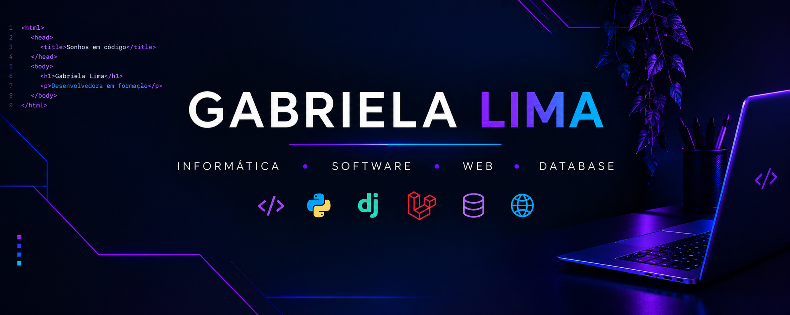

# 👋 Olá! Eu sou Gabriela Lima

### 💻 Desenvolvedora em formação | Técnica em Informática

🎓 Ensino Médio Integrado ao Técnico em Informática — IF Sertão-PE  
💻 Desenvolvimento Web • Software • Banco de Dados  
🚀 Transformando aprendizado em projetos e experiências reais

---

  

---

## 🧑‍💻 Sobre mim

Sou estudante do Ensino Médio Integrado ao Técnico em Informática no **IF Sertão-PE**, com interesse em **desenvolvimento de software, desenvolvimento web e banco de dados**.

Durante minha formação, venho desenvolvendo projetos acadêmicos e pessoais, buscando transformar os conhecimentos adquiridos em aplicações práticas.

Também participo de projetos de extensão relacionados à tecnologia e educação, tendo a oportunidade de aplicar meus conhecimentos em situações reais.

Atualmente, busco continuar evoluindo como desenvolvedora, aprendendo novas tecnologias e aprimorando a forma como desenvolvo meus projetos.

### 💻 Linguagens

  

### 🌐 Desenvolvimento Web

  

### ⚙️ Frameworks

  

### 🗄️ Banco de Dados

  

### 🛠️ Ferramentas

  

## 💻 Tecnologias e conhecimentos

### 🧠 Linguagens

  

### 🌐 Desenvolvimento Web

  

### ⚙️ Frameworks

  

### 🛠️ Ferramentas

  

### 🗄️ Banco de Dados

  

## 📌 Projetos e experiências

### 💻 Desenvolvimento Web e Software

Projetos desenvolvidos durante minha formação técnica, envolvendo criação de aplicações web, desenvolvimento de interfaces, back-end e integração com bancos de dados.

### 🧑‍🏫 Letramento Digital

Projeto de extensão do **IF Sertão-PE** voltado ao ensino de informática e tecnologias digitais para estudantes de escolas públicas.

Atuo no projeto como bolsista, participando do planejamento e realização de palestras e oficinas sobre informática, internet, segurança digital, ferramentas de produtividade e inteligência artificial.

### 🗄️ Banco de Dados

Desenvolvimento de atividades e aplicações envolvendo **modelagem, consultas e gerenciamento de bancos de dados**, utilizando SQL e MySQL.

### 🔧 Projetos Acadêmicos

Desenvolvimento de projetos e atividades práticas durante minha formação técnica, explorando diferentes linguagens, frameworks e ferramentas de desenvolvimento.

## 📫 Onde me encontrar

  
  
  

